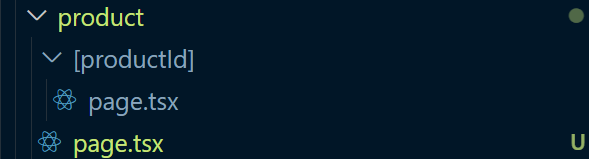

# Complete Next Js Basic To Advanced 🚀 🔥

## Quick Reference 

## Important Key Features of Next js 
1. Code Editor 
2. Node js 
3. Installation 
4. folder structure
5. Server components 
6. Routing 
7. Routing convention
8. Nested Routing
9. Dynamic Routing
10. Nested Dynamic Routing
11. Catch all Segment 
12. Not Found Page
13. File Co_location
14. Private folder 
15. Routes Group
16. layout
17. Nested layout 
18. Routes grouped layout
19. Routing MetaData
20. title metadata
21. Link component of Next js
22. Active link 
23. Navigating Programmatically
24. Loading ui 
25. Error Handling error.tsx 
26. Recovering from Error
27. Parallel Routes 
28. conditional Routes 
29.

## Project Setup 🧑‍💻
### 1.Code Editor 
### 2.Node js 
### 3.Installation

    npx create-next-app@latest
  
### 4. install dependencies
    npm install 
### 5. start server 
    npm run dev 

### 6. open browser 
    http://localhost:3000/

### 7. folder structure
1.package.json
    * this contains  project dependencies 
  
      {
      "name": "myapp1",
      "version": "0.1.0",
      "private": true,
      "scripts": {
        "dev": "next dev",
        "build": "next build",
        "start": "next start",
        "lint": "next lint"
      },
      "dependencies": {
        "myapp1": "file:",
        "next": "15.0.2",
        "react": "19.0.0-rc-02c0e824-20241028",
        "react-dom": "19.0.0-rc-02c0e824-20241028"
      },
      "devDependencies": {
        "@types/node": "^20",
        "@types/react": "^18",
        "@types/react-dom": "^18",
        "eslint": "^8",
        "eslint-config-next": "15.0.2",
        "postcss": "^8",
        "tailwindcss": "^3.4.1",
        "typescript": "^5"
      }
    }
  dev -> for the devlopment purpose 
  build -> for the build purpose production 
#  
2.next.config.ts 
* this file is used for the configuration of the next js
#
3..next folder 
* this will generate  when we run the project either in production or development mode
* From this folder our next js application will be served

#
4.Node modules folder 
* this folder store all the dependencies of the project 
* this will created when we run npm install commands
#
5. public folder  
* this will hold all the static files that serve 
#
6. src folder 
* in this folder we have another folder that is app folder 
* src > app this is newly introduced in the app router 
# 
7. src > app 
* inside the app folder we have 4 files 
 > 1. favicon.ico
 > 2. global.css -> global styles for app 
 > 3. layout.tsx -> shared across diff. pages
 > 4. page.tsx ->unique ui that show on visiting   this is children props in the layout.tsx to form a complete ui
 
#
## 8 . Server components 

* next js all components are server components by default
* we don't have capabilities to use hooks 
* To create client components it is necessary to add "use client" at top of the components file 
#

## 9 . Routing 
* Next js have file system  based routing mechanism
* url path that can access in the browser

### 10  Routing convention 🚀
* All Routes be placed inside the app folder 
* Every file that corresponds to a route must be named page.jsx or page.tsx
* Every folder to a path segment in the browser 

### 11 Nested Routing

### 12 Dynamic Routing 

* we have to create folder using [id]

### 13 Nested Dynamic Routing

### 14 Catch all Segment 
* [...slug]

### 15 Not Found Page 
* to create not found page we have to create a page in app folder 
* not-found.tsx 

## 16 File Co_location 
## Private folder 
* A private folder indicated that it is a private  implementation details and should not be considered  by the next js routing system🔥
* to create private folder we have to use _ underscore to make it private 

## 17 Routes Group 🔥🔥 
* Related Routes are grouped together
* it allow us to logically group the routes without affecting the  url path structure 
* For creating the routes group we have to use the ( ) all related routes are wrapped inside ()
  
examples: 

      (auth)
        >login
          page.tsx
        >register
          page.tsx

## 18 layout 
* share between multiple layouts 
>
    import React from 'react'

    const layout = ({children}:{
      children:React.ReactNode;
    }) => {
      return (
        

          <h1>layout</h1>
          <main>{children}</main>
        

      )
    }

    export default layout

## 19 Nested layout 

## 20 Routes grouped layout

## 21 Routing MetaData 
* it is crucial for the seo and visibility 
* Next js introduce  Metadata api  , it allow you to defined each page metaData 
* it must have to export the metadata object 
* two ways to implement 
* 1 in the layout.tsx 
* 2 in the page.tsx
>
    export const metadata = {
      title:"about us page"
    }
* dynamic metadata 
>
    import React from 'react';
    import { Metadata } from 'next';

    type Props = {
      params: {
        productId: string;
      };
    };

    // Function to generate metadata for the page
    export const generateMetadata = ({ params }: Props): Metadata => {
      return {
        title: `Product ${params.productId}`,
      };
    };

    // Main component for the page
    const Page = ({ params }: Props) => {
      return (
        

          <h1>Product {params.productId} Details</h1>
        

      );
    };
    export default Page;
#
## 22 title metadata
>
    export const metadata: Metadata = {
      title:{
        absolute:"",
        default: "Ashutosh  kumar next js ",
        template:"%s | Ashutosh", // this is used for dynamic
      },
      description: "Generated by create next app",
    };

##  23 Link component of Next js 
* Link is the react component that extends anchor tag html element

      <Link href={'/about'}>about</Link>

## 24 Active link 

## 25 Navigating Programmatically 
>
    import { useRouter } from 'next/navigation'

    const router = useRouter();
    router.push('/');
## 26 Loading ui 

## 27 Error Handling 
* ErrorBoundary component must be client component
> 
    "use client"
    const ErrorBoundary = ({error}:{
      error: Error
    }) => {
      return (
        

          <h1>{error.message}</h1>
        

      )
    }

    export default ErrorBoundary

## 28 Recovering from Error 

    "use client"
        const ErrorBoundary = ({error,reset}:{
          error: Error,
          reset: () =>void,
        }) => {
          return (
            

              <h1>{error.message}</h1>
              <button onClick=(reset)>Try Again</button>
            

          )
        }
      export default ErrorBoundary
* we also have to make page.tsx as client component
* when we switch within the ui other slots is unaffected

## 29 Parallel Routes 
Parallel routes are an advanced routing mechanism that allows for the simultaneous rendering of multiple pages within the same layout.

* Use the @folder naming convention to define ⭐ slots ⭐ for your routes.
* each slots is passes as a props to its corresponding layout.tsx file

## Unmatched routes 
* when page reload  next js immediately search for  default.tsx page with in each un match  slot
* default.tsx not found then next js render 404 page 

- [@Ashutosh kumar](https://github.com/Ashukr321)

## 🔗 Links

## Acknowledgements

 * Ashutosh kumar  for creating and maintaining this repository.

